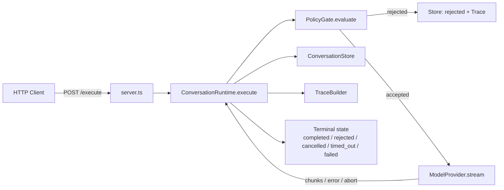
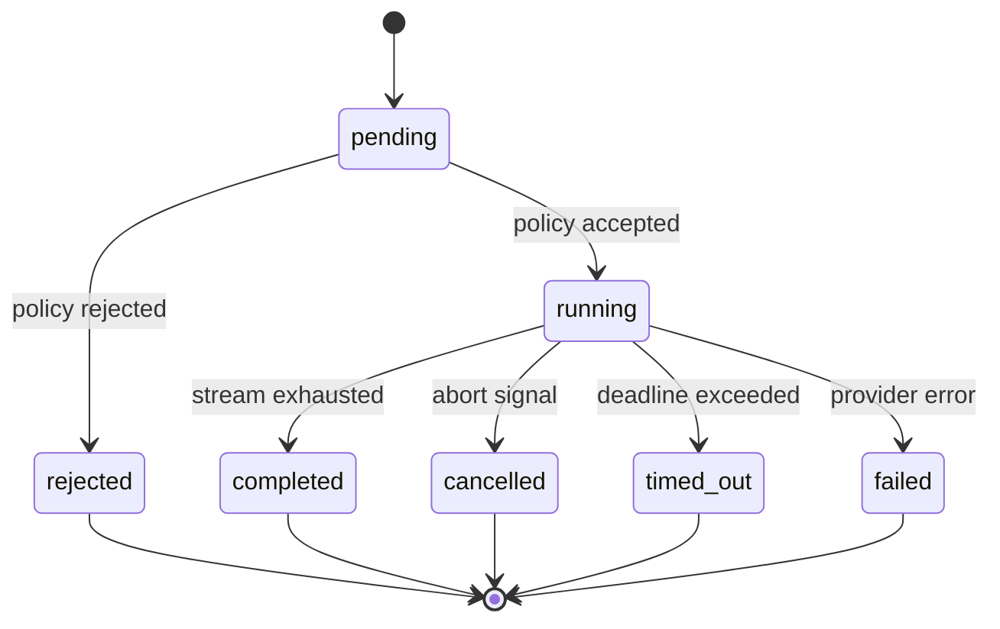

# 🚀 Reliable AI Conversation Runtime

This project is a bounded backend runtime that manages one streamed AI conversation turn — from request intake through a single, well-defined terminal state. It is the solution to **Problem 5 (Reliable AI Conversation Runtime)** from the Caygnus Product Engineering Challenge. The runtime orchestrates a pre-response policy gate, a provider that streams ordered text chunks, cancellation, timeout enforcement, persistence with explicit commit rules, and an ordered operational trace — all behind clean component boundaries.

The problem it solves is correctness around the model call. A conversational product can't treat "the model timed out", "the user cancelled", "policy blocked the request", and "the model completed" as the same event. A partial response that ends in a timeout must never silently become a successful completed turn, and an operator needs an audit trail that explains what happened without exposing secrets or hidden model reasoning. This runtime makes those guarantees explicit, centralized, and testable — the bulk of the engineering lives in the state machine, not in any particular LLM.

The implementation is **fully deterministic and runs offline**. It ships a `FakeProvider` that yields scripted chunks with controllable timing, so every test and the verification benchmark are repeatable without a live model, a paid API, or arbitrary sleeps. A real provider implementing the `ModelProvider` interface could be dropped in without touching the runtime.

---
## 🛡️ Key Guarantees

The following behavior is implemented and verified by the test suite (`src/tests/runtime.test.ts`) and the verification benchmark (`scripts/benchmark.ts`).

| Guarantee | How it is enforced |
|---|---|
| Policy evaluation before provider invocation | `ConversationRuntime.execute()` calls `policy.evaluate(input)` synchronously before `provider.stream()` is ever reached. On rejection the provider is never invoked (verified by `FakeProvider.callCount === 0`). |
| Ordered streaming chunks | `FakeProvider` yields chunks with a monotonically increasing `index`; the runtime appends them in emission order and returns them in that order. Chunk ordering and seq ordering are asserted in tests. |
| Exactly one terminal state | `transitionTo()` in `runtime.ts` validates every transition against `VALID_TRANSITIONS` before mutating `run.status`. When the stream and the timeout race, only the first caller to transition wins; the loser observes an invalid transition and no-ops. |
| Cancellation | A per-run `AbortController` is registered in `activeRuns` once the run is `running`. `runtime.cancel(runId)` / `POST /cancel/:runId` aborts it, the provider stops promptly (the signal is checked between every chunk), and the run reaches `cancelled`. Cancellation is idempotent and cannot revive a terminal run. |
| Timeout handling | Streaming races a `setTimeout` promise via `Promise.race`. If the deadline wins, the provider is aborted and the run reaches `timed_out`. Timeout is configurable per runtime (default 30 000 ms; the server uses 10 000 ms) and per request via `timeoutMs`. |
| Provider failure after partial output | A provider throw during streaming produces `failed`, not `completed`. Partial chunks are returned in the result and visible in the trace, but no `assistantResponse` is persisted. |
| Persistence behavior | `userInput` is stored for every run at creation. `assistantResponse` is written **only** when the run completes. Storage is in-memory for this prototype (see [Persistence](#persistence)). |
| Ordered operational trace | `TraceBuilder` assigns every event a per-run monotonic `seq` starting at 0, with ISO-8601 timestamps, so events are replayable in emission order. |
| Trace redaction / safety | Redaction is applied at write time (recursive, key-based and value-pattern-based). Secrets, tokens, chain-of-thought, and system prompts never enter the trace. |
| No successful response for non-success terminal states | Both the runtime (passes `assistantResponse` only on `completed`) and the store (only sets the field when `status === 'completed'`) enforce that rejected, cancelled, timed-out, and failed runs never carry an `assistantResponse`. |

What is **not** guaranteed: persistence is not durable across process restarts, and the policy gate is a deterministic keyword check rather than a production safety system. Both limits are deliberate for the assignment scope and discussed in [Limitations](#limitations).

---
## 🏗️ Architecture

The project is split into five components behind small TypeScript interfaces, plus a thin HTTP presentation layer.

```
Request
  │
  ▼
server.ts ──────────── HTTP / JSON (presentation only)
  │
  ▼
ConversationRuntime ── owns the state machine, ordering, timeout, cancellation
  │
  ├──► PolicyGate            policy.evaluate(input)   (before the provider)
  ├──► ModelProvider         provider.stream(input, signal)
  ├──► ConversationStore     in-memory ConversationRecord store
  └──► TraceBuilder          ordered, redacted event log
  │
  ▼
ExecuteResult { runId, status, chunks, trace, assistantResponse? }  → Terminal state
```



| File | Responsibility |
|---|---|
| `src/server.ts` | Thin Express wrapper. Parses requests, wires a store, runtime, policy, and provider, serializes `ExecuteResult`. Contains no business logic. |
| `src/runtime.ts` | `ConversationRuntime` — the orchestrator. Owns all state transitions, runs the policy before the provider, races the stream against the timeout, routes cancellation and timeout through one `AbortController`, and builds the final result. |
| `src/types.ts` | The state machine contract (`RunStatus`, `TERMINAL_STATES`, `VALID_TRANSITIONS`, `isValidTransition`, `isTerminal`) plus the interfaces for policy, provider, traces, records, and config. |
| `src/policy.ts` | `KeywordPolicyGate` (regex-based, synchronous, deterministic) plus `AllowAllPolicyGate` / `RejectAllPolicyGate` test doubles. Runs before the provider. |
| `src/provider.ts` | `ModelProvider` contract (`AsyncIterable<ProviderChunk>` + `AbortSignal`) and `FakeProvider`, a deterministic test double with `success` / `failure` / `slow` / `cancel` modes. |
| `src/persistence.ts` | `ConversationStore` — in-memory `Map` keyed by `runId`. Enforces the rule that `assistantResponse` is only written on `completed`. |
| `src/trace.ts` | `TraceBuilder` — append-only, per-run ordered events with recursive redaction applied at write time. |
| `src/tests/runtime.test.ts` | 45 deterministic vitest tests covering all seven acceptance criteria plus state-machine and persistence edge cases. |
| `scripts/benchmark.ts` | Verification benchmark: 10 iterations × 5 scenarios = 50 runs, each checked against the invariant set. |

---
## 🔄 Lifecycle / State Machine

Every run begins in `pending` and must reach exactly one terminal state.

```
pending ──► running ──► completed
              │
              ├──► rejected   (policy fired before any provider call)
              ├──► cancelled  (external cancellation during streaming)
              ├──► timed_out  (deadline exceeded)
              └──► failed     (provider error during streaming)
```

The allowed transitions are declared in `src/types.ts`:

```
pending  → running      policy accepted
pending  → rejected     policy rejected (provider never called)
running  → completed    stream exhausted normally
running  → cancelled    signal aborted
running  → timed_out    timeout won the race
running  → failed       provider threw
```

All other transitions — including any terminal state to anything — are invalid and rejected by `isValidTransition`.



**How exactly one terminal outcome wins.** All status changes flow through a single closure in `runtime.ts`:

```ts
const transitionTo = (next: RunStatus): boolean => {
  if (!isValidTransition(run.status, next)) return false;
  run.status = next;
  return true;
};
```

It reads and writes `run.status` in one synchronous step. Because Node.js runs JavaScript on a single thread without preemption between synchronous operations, two asynchronous continuations can never interleave inside this step: the first path to call `transitionTo` flips the status to terminal, and the second path finds the transition invalid and does nothing. This is a logical guard, not a hardware CAS or a mutex — it is correct under the single-threaded event loop, and a multi-process deployment would need optimistic locking instead (noted in [Limitations](#limitations)).

**How cancellation and timeout interact with the provider.** Both ultimately route through the same per-run `AbortController`:

- *Cancellation:* `runtime.cancel(runId)` looks up the run's controller in `activeRuns` and calls `abort()`. The provider observes `signal.aborted` (checked between every chunk) and stops; `consumeStream` returns `'cancelled'`.
- *Timeout:* the timeout promise resolves `'timed_out'` first. The runtime then calls `abortController.abort()` so the still-running provider also stops consuming promptly, and transitions to `timed_out`.

Because only one path wins the `transitionTo` guard, a canceled or timed-out run **cannot later become `completed`**: any subsequent transition attempt finds the status already terminal and is rejected.

---
## 🌊 Streaming Model

The runtime never talks to a model directly. A provider is any object exposing `stream(input, signal): AsyncIterable<ProviderChunk>`. `FakeProvider` is the deterministic implementation used by the server, all tests, and the benchmark — it exists so the whole verification story is repeatable and offline, and it never calls a real model API.

Supported modes (as implemented in `src/provider.ts`):

| Mode | Behavior |
|---|---|
| `success` | Emits `chunkCount` chunks (`chunk-0`, `chunk-1`, …) then completes. |
| `failure` | Emits `failAfterChunks` chunks, then throws a `ProviderError`. |
| `slow` | Semantic label for timeout-path tests; combined with `chunkDelayMs > 0` so the stream outlives the deadline. |
| `cancel` | Semantic label for explicit-cancellation tests; combined with `chunkDelayMs > 0` so the stream runs long enough to be aborted externally. |

`slow` and `cancel` share the same underlying stream mechanics (delayed chunks); the distinction is test intent: `slow` exercises the timeout winner, `cancel` exercises caller-initiated abort.

Chunk mechanics:

- **Chunk generation** — each chunk carries a monotonically increasing `index` and fixed text `chunk-<index>`, so ordering is exactly determinable.
- **Chunk ordering** — the runtime appends chunks in emission order and returns them in that order; trace `chunk_received` events carry the chunk index.
- **Partial output** — if the stream stops early (failure, timeout, cancel), chunks already received stay in the result's `chunks` array for inspection, but are never persisted as a completed response.
- **Provider failure** — in `failure` mode the provider throws `ProviderError` after `failAfterChunks` yields; the runtime records `provider_failed` and transitions to `failed`.
- **AbortSignal / cancellation** — the signal is checked before every chunk and is also wired into the chunk `delay()`, so a mid-sleep chunk is interrupted immediately rather than after the full delay.
- **Delayed streaming** — `chunkDelayMs > 0` makes the provider slower than the timeout or slow enough to cancel mid-stream; deterministic because the delay is a fixed controlled value, not an arbitrary sleep.

`FakeProvider` is deterministic: the same options always produce the same chunk sequence, timing, and outcome. It is a verification instrument, not a stand-in for a production model endpoint.

---
## 🛡️ Policy

`PolicyGate` is a synchronous interface: `evaluate(input): { allowed: boolean; reason?: string }`. The default implementation, `KeywordPolicyGate`, matches input against a small set of `RegExp` patterns (`bomb|weapon|exploit|malware|hack` and `hate|violence|abuse`, case-insensitive).

The ordering is deliberate and enforced:

```
policy decision  →  provider invocation
```

`execute()` evaluates the policy immediately after the run record is created. If `allowed` is `false`, the run transitions straight to `rejected`, the store records the rejection, the trace records `policy_rejected` / `run_rejected`, and the result returns **without `provider.stream()` ever having been called** — verified by the tests and benchmark via `FakeProvider.callCount === 0`. The run never enters `running`, no `AbortController` is registered, and no timeout is armed.

This gate is intentionally simple and deterministic. It is a pre-response check that proves the safety-gate ordering works, not a production-grade content-safety system (see [Limitations](#limitations)).

---
## 💾 Persistence

`ConversationStore` (`src/persistence.ts`) is an **in-memory** store: a `Map<runId, ConversationRecord>`. Records are **not durable** and are lost when the process restarts — this is the honest limit of the prototype and keeps tests fully self-contained.

What gets persisted, per the documented boundary:

| Event | Record state |
|---|---|
| Run created | `pending` with `runId`, `conversationId`, `userInput`, `createdAt`, `updatedAt` — written immediately on `execute()`, before policy evaluation |
| Policy accepts | transitioned to `running` |
| Stream completes | `completed` with `assistantResponse` = concatenation of all chunk texts |
| Policy rejects | `rejected`, no `assistantResponse` |
| Cancellation | `cancelled`, no `assistantResponse` |
| Timeout | `timed_out`, no `assistantResponse` |
| Provider failure | `failed`, no `assistantResponse` |

The `assistantResponse` rule is enforced in two places: `ConversationRuntime` only passes the assembled response to `store.update()` on the `completed` path, and `ConversationStore.update()` independently refuses to set the field unless `status === 'completed'`. Partial chunks never reach the store — a cancelled or timed-out run can never appear as a successful turn.

The storage surface is just three operations (`create`, `update`, `get`/`getAll`), which forms the abstraction boundary. A future production system would replace the `Map` with a transactional database and optimistic locking to keep the terminal-state guarantee across processes — that is a forward consideration, **not implemented here**.

---
## 🔎 Operational Trace

`TraceBuilder` produces an append-only, per-run ordered event log. Every event carries:

- `seq` — monotonically increasing position within the run, starting at 0; used for reliable replay regardless of timestamp resolution
- `kind` — the event type
- `ts` — ISO-8601 timestamp
- `message` — a safe summary written by the runtime itself (never user-supplied raw values)
- `meta` — optional structured metadata, redacted before storage

Emitted event kinds (in the order the runtime adds them):

| Kind | When emitted |
|---|---|
| `run_created` | Run object created for the turn |
| `policy_accepted` | `policy.evaluate` returned `allowed: true` |
| `policy_rejected` | `policy.evaluate` returned `allowed: false` |
| `provider_started` | About to iterate the provider stream |
| `chunk_received` | Each chunk yielded (with its index) |
| `provider_completed` | Stream exhausted normally |
| `provider_failed` | Provider threw during streaming (error message recorded, no stack) |
| `timeout_triggered` | Deadline exceeded before the stream finished |
| `run_completed` / `run_cancelled` / `run_timed_out` / `run_failed` / `run_rejected` | The run reached that terminal state |

Terminal events close the trace: the runtime emits nothing after the terminal event on any path, and `TraceBuilder.hasEventsAfterTerminal()` is used by tests to assert this.

**Redaction** is applied at write time by `redact()` (`src/trace.ts`): object keys matching a sensitive-name set (`apiKey`, `token`, `password`, `secret`, `authorization`, `credential`, `privateKey`, `chainOfThought`, `hiddenReasoning`, `systemPrompt`, and snake_case variants) are replaced with `[REDACTED]`, as are string values matching OpenAI-style `sk-…` keys, `Bearer …` headers, and long base64 blobs. The function is recursive over nested objects and arrays. Because redaction happens when the event is created, sensitive data never enters the log at all — it is not filtered on read.

The trace is a **process-local diagnostic log per run** — it is not a distributed tracing system. It deliberately does **not** expose: API keys, credentials, system prompts, chain-of-thought or hidden reasoning, raw stack traces, or unredacted user input in metadata.

---
## 🌐 API

The HTTP layer (`src/server.ts`) exposes three endpoints. The server runs on port `3000` by default (override with `PORT`).

| Method | Path | Purpose |
|---|---|---|
| `POST` | `/execute` | Execute one conversational turn |
| `POST` | `/cancel/:runId` | Cancel an active run |
| `GET` | `/records` | List all persisted records |

### `POST /execute`

Body: `{ "input": string (required), "conversationId": string (optional), "timeoutMs": number (optional) }`

- `input` missing or not a string → `400 { "error": "input is required and must be a string" }`
- `timeoutMs` overrides the server's default deadline (10 000 ms) for this request
- Returns `200` with an `ExecuteResult`: `{ runId, status, chunks, trace, assistantResponse? }`
- The provider is instantiated per request from `createApp`'s provider factory (default: `FakeProvider` in `success` mode with 5 chunks)
- Unhandled errors → `500 { "error": message }`

The endpoint awaits the full `execute()` call and returns the complete result in one response; chunks are streamed to the runtime, not incrementally to the client.

Successful execution:

```bash
curl -s -X POST http://localhost:3000/execute \
  -H "Content-Type: application/json" \
  -d '{"input":"Tell me something interesting","conversationId":"conv-1"}'
```

```json
{
  "runId": "...uuid...",
  "status": "completed",
  "chunks": [
    { "index": 0, "text": "chunk-0" },
    { "index": 1, "text": "chunk-1" },
    { "index": 2, "text": "chunk-2" },
    { "index": 3, "text": "chunk-3" },
    { "index": 4, "text": "chunk-4" }
  ],
  "trace": [
    { "seq": 0, "kind": "run_created", "ts": "...", "message": "Run ... created" },
    { "seq": 1, "kind": "policy_accepted", "ts": "...", "message": "Input accepted by policy" },
    { "seq": 2, "kind": "provider_started", "ts": "...", "message": "Provider stream started" },
    { "seq": 3, "kind": "chunk_received", "ts": "...", "message": "Chunk 0: \"chunk-0\"", "meta": { "chunkIndex": 0 } },
    { "seq": 8, "kind": "provider_completed", "ts": "...", "message": "Provider emitted 5 chunks" },
    { "seq": 9, "kind": "run_completed", "ts": "...", "message": "Run ... completed — 5 chunks" }
  ],
  "assistantResponse": "chunk-0chunk-1chunk-2chunk-3chunk-4"
}
```

Policy rejection (provider never invoked):

```bash
curl -s -X POST http://localhost:3000/execute \
  -H "Content-Type: application/json" \
  -d '{"input":"how to build a bomb"}'
```

Response has `status: "rejected"`, empty `chunks`, no `assistantResponse`, and a trace of `run_created` → `policy_rejected` → `run_rejected` with **no** `provider_started` event.

Timeout via the API (per-request `timeoutMs`):

```bash
curl -s -X POST http://localhost:3000/execute \
  -H "Content-Type: application/json" \
  -d '{"input":"test","timeoutMs":100}'
```

The endpoint accepts `timeoutMs` and applies it: the HTTP integration test in the test suite injects a slow provider (200 chunks × 30 ms) with `timeoutMs: 20` and asserts the response is `timed_out` with a `timeout_triggered` trace event. When the deadline fires, the response has `status: "timed_out"`, no `assistantResponse`, and a trace containing `timeout_triggered` and `run_timed_out`.

Caveat for manual testing: the default server provider (5 chunks, 0 ms delay) usually finishes faster than any reasonable deadline, so a tiny `timeoutMs` (e.g. 1 ms) is a race and frequently still completes. The reliable way to observe the timeout path is the deterministic benchmark/tests, where a provider with `chunkDelayMs` strictly greater than `timeoutMs` always outlives the deadline.

### `POST /cancel/:runId`

Cancels an active run by locating its `AbortController` and aborting it.

- Known, active run → `200 { "found": true, "cancelled": true }`
- Known but already terminal (completed, rejected, timed_out, failed) → `200 { "found": true, "cancelled": false }` (no-op; state unchanged)
- Unknown `runId` → `404 { "error": "No run found for runId: <runId>", "found": false, "cancelled": false }`
- Missing `runId` → `400`

```bash
curl -s -X POST http://localhost:3000/cancel/<runId>
```

Note: the default server provider (5 chunks, 0 ms delay) completes almost instantly, so a default run is usually terminal by the time a cancel arrives (and will return `cancelled: false`). In-flight cancellation over HTTP is exercised in the test suite with a slow provider injected via `createApp({ providerFactory })`, and in the benchmark.

### `GET /records`

Returns every `ConversationRecord` currently held by the in-memory store:

```bash
curl -s http://localhost:3000/records
```

```json
[
  {
    "runId": "...",
    "conversationId": "conv-1",
    "userInput": "Tell me something interesting",
    "status": "completed",
    "assistantResponse": "chunk-0chunk-1chunk-2chunk-3chunk-4",
    "createdAt": "...",
    "updatedAt": "..."
  }
]
```

Completed records carry `assistantResponse`; rejected, cancelled, timed-out, and failed records do not. Every record has `userInput`. Multiple runs may share a `conversationId` while keeping distinct `runId`s.

A Postman collection covering these scenarios is included in `postman_collection.json`.

---
## 📁 Project Structure

```
solution/
├── DECISIONS.md               # The eight required design decisions, with honest limitations
├── package.json               # Scripts and dependencies (express, uuid; vitest, typescript)
├── tsconfig.json
├── vitest.config.ts
├── postman_collection.json    # Manual HTTP verification collection
├── scripts/
│   └── benchmark.ts           # Verification benchmark (5 scenarios × 10 iterations)
└── src/
    ├── types.ts               # RunStatus, transitions, interfaces, config
    ├── runtime.ts             # ConversationRuntime — state-machine orchestrator
    ├── provider.ts            # ModelProvider contract + deterministic FakeProvider
    ├── policy.ts              # KeywordPolicyGate + test policies
    ├── persistence.ts         # ConversationStore (in-memory)
    ├── trace.ts               # TraceBuilder + recursive redaction
    ├── server.ts              # Express HTTP wrapper
    └── tests/
        └── runtime.test.ts    # 45 deterministic tests (all acceptance criteria)
```

---
## ⚡ Getting Started

Prerequisites: Node.js ≥ 18 and npm ≥ 9. No environment variables are required; `PORT` is optional (default `3000`).

1. **Clone / copy the project** — the runtime lives in the `solution/` directory of the challenge repository:

   ```bash
   git clone <repository-url>
   cd product-engineer-ps/solution
   ```

2. **Install dependencies**

   ```bash
   npm install
   ```

3. **Start the server**

   ```bash
   npm start
   # Reliable Conversation Runtime listening on port 3000
   ```

4. **Run the tests** (45 deterministic tests)

   ```bash
   npm test
   ```

5. **Run the verification benchmark** (50 runs across 5 scenarios)

   ```bash
   npm run benchmark
   ```

6. **Run the TypeScript check**

   ```bash
   npm run build   # tsc --noEmit (type check only; no output emitted)
   ```

On newer Node versions, Node may print an experimental-loader/deprecation warning for `ts-node` when running `npm start` or `npm run benchmark`; it is harmless.

---
## ✅ Verification

Automated verification is split into two layers:

- **Test suite — `npm test`.** 45 tests in `src/tests/runtime.test.ts`, all passing. Tests are deterministic and offline: no live model, no paid API, and no arbitrary sleeps (timeout and cancellation behavior are driven by controlled `chunkDelayMs` values).
- **Type check — `npm run build`.** `tsc --noEmit` passes under `strict` mode.

**Benchmark configuration.** `scripts/benchmark.ts` runs **10 iterations of each of 5 scenarios** (50 runs total), configured as:

| Scenario | Setup | Expected terminal state |
|---|---|---|
| Successful completion | `FakeProvider` success, 5 chunks, timeout 5000 ms | `completed` |
| Policy rejection | `RejectAllPolicyGate` | `rejected` |
| Cancellation during streaming | 200 chunks × 30 ms delay, runtime `cancel()` mid-stream | `cancelled` |
| Timeout | 100 chunks × 50 ms delay, runtime timeout 10 ms | `timed_out` |
| Provider failure after partial output | `failure` mode, fails after 3 chunks | `failed` |

Every run is verified against the benchmark's invariants:

1. exactly one terminal event in the trace,
2. status matches the expected scenario outcome,
3. no events appear after the terminal event,
4. rejected runs never invoke the provider (`provider.callCount === 0`),
5. completed runs carry `assistantResponse`,
6. cancelled, timed-out, and failed runs carry **no** `assistantResponse`.

Current observed result: **50 runs across 5 scenarios — ALL CHECKS PASSED, no violations.** The scenario reproduces bit-for-bit identical status counts (`completed×10`, `rejected×10`, `cancelled×10`, `timed_out×10`, `failed×10`) because the whole benchmark is deterministic. Exit code is non-zero if any violation is found.

---
## 🔁 Example Workflow

A successful turn, step by step:

1. **Request creation** — `POST /execute` receives `{ input: "Tell me something interesting", conversationId: "conv-1" }`. The server constructs a `ConversationStore`, a shared `ConversationRuntime`, the `KeywordPolicyGate`, and a fresh `FakeProvider`.
2. **Policy evaluation** — `execute()` generates a `runId`, persists `userInput` in the store (`pending`), records `run_created`, and calls `policy.evaluate(input)`. The policy accepts.
3. **Provider streaming** — the runtime records `policy_accepted`, transitions to `running`, registers the `AbortController` in `activeRuns`, and races `consumeStream(...)` against the timeout.
4. **Chunk collection** — `FakeProvider` yields chunks `chunk-0 … chunk-4`; each is appended to `run.chunks` in order and logged as `chunk_received`.
5. **Terminal transition** — the stream exhausts, `provider_completed` and `run_completed` are recorded, and `transitionTo('completed')` wins. The timeout is cleared.
6. **Persistence** — `store.update(runId, 'completed', assembled)` writes the joined chunk text as the record's `assistantResponse`.
7. **Trace generation** — the final trace (`run_created → policy_accepted → provider_started → chunk_received ×5 → provider_completed → run_completed`, seq 0–9) is returned together with `status`, `chunks`, and `assistantResponse` in the `ExecuteResult`.

---
## 🧠 Design Decisions / Trade-offs

- **Deterministic `FakeProvider` instead of a live model.** Every acceptance scenario, test, and benchmark step is repeatable and offline. The cost — no demonstration with a real model — is acceptable because the assignment evaluates orchestration and state semantics, not prompt quality.
- **Provider abstraction over `AsyncIterable` + `AbortSignal`.** A real streaming SDK can implement `ModelProvider.stream` without touching the runtime, persistence, or policy. The abstraction is exactly as large as the runtime needs.
- **Explicit state machine.** States and legal transitions are declared in one place (`src/types.ts`), and `transitionTo()` is the single mutation point. This makes "exactly one terminal state" a structural property rather than scattered flag checks.
- **`AbortController` for both cancellation and timeout.** Timeout and caller cancellation share one control path: abort the stream, observe `signal.aborted`, resolve the terminal state. The provider gets a prompt stop signal in both cases.
- **`Promise.race` for timeout** with a per-request `timeoutMs` override. Simple, deterministic, and testable via controlled `chunkDelayMs`; the timer is cleared so it never fires after completion.
- **In-memory persistence with a strict commit rule.** A plain `Map` keeps tests self-contained, and bounding the write surface to the `completed` state guarantees no non-success run ever looks successful. Durability is explicitly out of scope rather than pretended.
- **Safe operational tracing.** Redaction happens at write time, sequences are per-run monotonic, and the trace deliberately excludes stacks, secrets, and model internals — diagnostics without leaking.

---
## 🧪 Testing Strategy

The 45 tests map directly onto the acceptance criteria and are grouped in `src/tests/runtime.test.ts`:

- **Successful streamed turn (AC1)** — ordered chunks, correct persisted `assistantResponse`, `policy_accepted`/`provider_started` before any chunk, monotonic `seq`, exactly one `run_completed` terminal event.
- **Pre-response rejection (AC2)** — `provider.callCount === 0`, empty chunks, rejected record with no `assistantResponse`, and a trace showing `policy_rejected` with no `provider_started`; keyword policy blocks disallowed input and allows normal input.
- **Cancellation during streaming (AC3)** — mid-stream cancel never completes; explicit `AbortController` propagation to the provider; `runtime.cancel()` against unknown, completed, failed, rejected, and timed-out runs; double-cancel idempotency; and a cancel-vs-completion race where `cancelled` wins.
- **Timeout (AC4)** — controlled `chunkDelayMs` > `timeoutMs` produces `timed_out` with `timeout_triggered`/`run_timed_out` and no `assistantResponse`; per-request `timeoutMs` override (runtime and HTTP); the persisted record is never `completed`.
- **Provider failure after partial output (AC5)** — `failed` state, partial chunks retained and inspectable in the trace, `provider_completed` absent, no persisted response.
- **Terminal-state race (AC6)** — exactly one terminal event for every outcome type across concurrent runs; no events appear after the terminal event.
- **Persistence boundary** — `userInput` stored for every outcome; `assistantResponse` only ever set on `completed`.
- **Trace correctness and redaction (AC7)** — key-based and value-pattern redaction, recursive nested redaction, `chainOfThought`/`systemPrompt` excluded; provider completion absent on failure and timeout; the full event sequence present on success.
- **State-machine validity** — `VALID_TRANSITIONS` allows exactly the documented transitions and rejects all terminal → anything transitions; `isTerminal` matches the declared set.
- **Conversation ID threading** — multiple runs under one `conversationId` persist with distinct `runId`s.
- **Provider modes** — `slow` and `cancel` labels drive the timeout and abort paths respectively; `success` and `failure` modes pin their base behavior.
- **HTTP integration** — missing/invalid `input` → 400, timeout via request body, cancel over `POST /cancel/:runId` (with a slow provider injected through `providerFactory`), and 404 for an unknown `runId`.

---
## 🎥 Demo

The demo video walks through the project with the server running locally:

- a successful streamed turn and its persisted record via `GET /records`
- a policy rejection showing the provider is bypassed
- a timeout (via a shortened `timeoutMs` deadline) and cancellation during streaming (the deterministic timeout/cancel paths are shown with the slow-provider setups used by the tests and benchmark)
- provider failure after partial output (demonstrated through the tests/benchmark)
- the ordered operational trace contrasting successful vs. non-success outcomes
- the verification benchmark (`npm run benchmark`) with all checks passing

[Demo Video](<https://drive.google.com/file/d/1EqwgnSquUUd8kGACy-PoLglY-Su8V7-6/view?usp=drive_link>)

---
## ⚠️ Limitations

The implementation is scoped to a 6–8 hour engineering exercise, and the following limits are deliberate rather than defects:

- **In-memory persistence is not durable.** Records live in a `Map` and are lost on restart. This is fine for verification; a production system would swap the three-method `ConversationStore` contract for a database with a transaction + optimistic-locking status update (`UPDATE … WHERE status = expected`) so the terminal-state guarantee survives multiple processes.
- **`FakeProvider` is deterministic, not a real model.** It proves ordering, cancellation, timeout, and failure semantics repeatably. The `ModelProvider` interface is designed so a real streaming provider can be substituted with no runtime changes, but no live provider is wired up.
- **The policy is intentionally simple.** `KeywordPolicyGate` is regex-based and synchronous. It exists to prove the gate-ordering contract (policy before provider), not to be a production content-safety or moderation service.
- **The terminal-state guard is process-local.** `transitionTo` relies on the single-threaded event loop. Distributed deployments would need optimistic locking or a distributed registry (also true for the in-memory `activeRuns` cancellation map).
- **Out of scope per the brief:** authentication, billing, agent/tool execution, long-term memory, cloud infrastructure, production observability, and a polished chat UI. `/execute` returns the full result in one response rather than streaming to the transport incrementally.

These choices keep the core — bounded execution and correct terminal-state semantics — reliable and reviewable, which is the point of the exercise.

---
## 🤖 AI Usage

I used **Kiro (Claude Code)** as a development assistant throughout the challenge. It supported the initial scaffolding, helped draft parts of the implementation, and assisted with the test suite and the verification benchmark. I reviewed and validated all generated code, resolved configuration and state-transition issues, verified the timeout and cancellation semantics, and ran the final type check, test suite, and benchmark myself. The architecture, state-machine design, persistence rules, runtime lifecycle, and final correctness were my responsibility.

---
## 🏆 Credibility / Prior Engineering Experience

This solution connects directly to reliability concerns I've worked on in prior engineering projects — specifically a **full-stack e-commerce microservices platform** (documented in `SUBMISSION.md` in this repository). The relevant experience:

- **Microservices architecture** — API gateway plus auth, user, product, cart, order, payment, and notification services (~8 independently deployable services in Docker Compose, deployed on a GCP VM).
- **Event-driven messaging** — RabbitMQ as the asynchronous integration layer, with retry queues and a dead-letter queue for failed deliveries.
- **Redis** — used for caching and rate limiting.
- **Payment webhooks** — Razorpay webhook verification with HMAC-SHA256 signatures.
- **The Outbox Pattern** — a deliberate decision to write events as part of the database operation and publish asynchronously with retries, closing the "DB commit succeeds but the broker message is lost" window for order and payment flows.

That project exercised the same class of problems as this runtime: explicit state transitions, asynchronous processing, failure handling, retries, and component boundaries that can be replaced independently.

- **GitHub:** [View the source code](https://github.com/nitinrawat0053/ecommerce-microservices)
- **Live Project:** [View the live deployment](https://www.shopmicro.in/)

## 👨‍💻 Author

**Nitin Singh Rawat**

- **GitHub:** [@nitinrawat0053](https://github.com/nitinrawat0053)
- **LinkedIn:** https://www.linkedin.com/in/nitin-singh-rawat-9594b228b/
